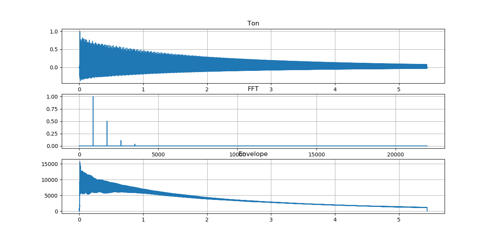

# Soundgenerator
This is a hobby project to play around with analyzing and creating sounds. I also implemented some effects like chorus, distortion and flanger.

## Features
* Analyzing sound in time, frequency and Hilbert space
* Generating new sounds depending on frequency, spectrum and envelope.
* Applying sound effects like reverb, distortion, flanger, chorus and tremolo

## Plot of a guitar sound

